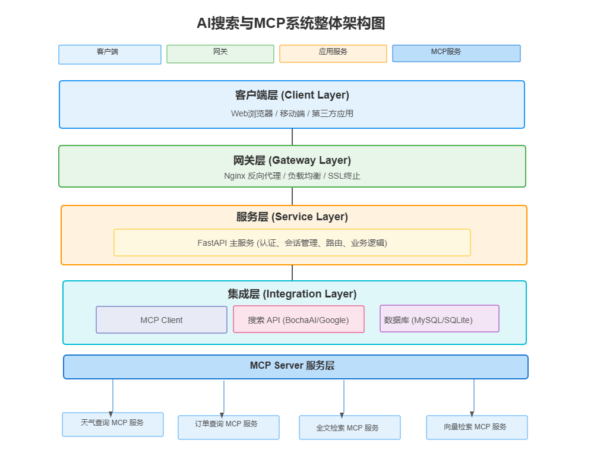

# KnowFlow AI Search - 智能问答与工具集成平台



## 📖 项目简介

KnowFlow AI Search 是一个集成了先进AI搜索、大型语言模型（LLM）和模型上下文协议（MCP）的综合性智能问答平台。它不仅能提供流畅的对话体验，还能通过MCP动态扩展和调用外部工具（如天气查询、订单管理等），实现复杂的业务逻辑。

本项目旨在作为 **AI搜索与MCP技术** 的实战教学案例，展示如何从零开始构建一个模块化、可扩展的AI应用。

## ✨ 主要功能

- **🚀 流式对话**: 基于 FastAPI 和 `asyncio` 实现的实时流式响应，带来流畅的对话体验。
- **🌐 集成网络搜索**: 可在回答问题前进行网络搜索，获取最新的信息，使回答更具时效性和准确性。
- **🧩 MCP工具扩展**: 支持通过模型上下文协议（MCP）动态注册和调用外部工具服务。
  - 内置了天气查询和订单查询两个MCP服务作为示例。
  - 提供了完整的MCP服务器管理界面，方便添加、删除和刷新工具。
- **💾 会话管理**:
  - 自动保存所有对话历史。
  - 支持查看、删除和导出（JSON格式）特定会话。
- **🐳 Docker化部署**: 提供完整的 `docker-compose` 配置，实现一键启动所有服务，简化部署流程。
- **📝 代码优化与注释**: 所有核心代码均经过重构，并附有详尽的中文注释，易于理解和二次开发。

## 🛠️ 技术栈

- **后端**: Python, FastAPI
- **AI模型**: OpenAI-compatible APIs (e.g., Zhipu GLM series)
- **工具协议**: MCP (Model Context Protocol) via `fastmcp`
- **数据库**: SQLite
- **Web服务器**: Uvicorn, Nginx (as reverse proxy)
- **进程管理**: Supervisor
- **容器化**: Docker, Docker Compose

## 🚀 快速开始

我们提供两种启动方式：通过 Docker Compose 一键部署（推荐，适用于生产和标准开发环境），或在本地手动启动各个服务（适用于深度开发和调试）。

### 方案一：使用 Docker 部署 (推荐)

请确保您的系统已安装 `Docker` 和 `Docker Compose`。

#### 1. 克隆项目

```bash
git clone <your-repository-url>
cd KnowFlowAISearch
```

#### 2. 配置环境变量

项目需要一个 `.env` 文件来存储敏感配置。请在 `app/` 目录下创建一个 `.env` 文件（可参考 `app/.env.example`，如果存在的话）。

```ini
# .env file for KnowFlow AI Search
# 存放在 app/ 目录下

# 大模型 API 配置 (以智谱AI为例)
# API Key, 请替换为您自己的 Key
API_KEY="your-zhipu-api-key"
# API Base URL
BASE_URL="https://open.bigmodel.cn/api/paas/v4/"
# 使用的模型名称
MODEL_NAME="glm-4-flash"

# BochaAI 搜索 API Key (可选，如果需要网络搜索功能)
# 请替换为您自己的 Key
BOCHAAI_SEARCH_API_KEY="your-bochaai-api-key"
```

**注意**: 如果您不使用网络搜索功能，可以将 `BOCHAAI_SEARCH_API_KEY` 留空。

#### 3. 启动服务

在项目根目录下，执行以下命令：

```bash
docker-compose up --build
```
此命令会构建 `app` 服务的 Docker 镜像，并启动所有在 `docker-compose.yml` 中定义的服务。

### 方案二：本地手动启动 (用于开发)

如果您希望在本地直接运行和调试代码，请遵循以下步骤。

#### 1. 环境准备

首先，创建并激活一个Python虚拟环境。

```bash
# 在项目根目录下创建虚拟环境
python3 -m venv venv

# 激活虚拟环境 (macOS/Linux)
source venv/bin/activate
# 激活虚拟环境 (Windows)
# venv\Scripts\activate
```

然后，安装所有必需的依赖项。

```bash
pip install -r app/requirements.txt

pip3.13 install --trusted-host pypi.tuna.tsinghua.edu.cn -i https://pypi.tuna.tsinghua.edu.cn/simple -r requirements.txt
```

#### 2. 配置环境变量

同 Docker 方案一样，您需要在 `app/` 目录下创建并配置好 `.env` 文件。请参考 **方案一** 中的说明。

#### 3. 启动各个服务

您需要打开 **三个** 独立的终端窗口，并在每个窗口中都激活虚拟环境 (`source venv/bin/activate`)，然后分别启动以下服务：

**终端 1: 启动主应用 (FastAPI)**
```bash
uvicorn app.main:app --host 0.0.0.0 --port 8000 --reload
```

**终端 2: 启动天气MCP服务**
```bash
uvicorn app.mcp_server.weather_service:app --host 0.0.0.0 --port 9001 --reload
```

**终端 3: 启动订单MCP服务**
```bash
uvicorn app.mcp_server.order_service:app --host 0.0.0.0 --port 9002 --reload
```
`--reload` 参数会使服务在代码变更时自动重启，非常适合开发。

## 💻 如何使用

- **Docker 方式启动**:
  - **聊天主界面**: `http://localhost` (由 Nginx 代理)
  - **MCP服务管理后台**: `http://localhost/mcp`

- **手动方式启动**:
  - **聊天主界面**: `http://localhost:8000`
  - **MCP服务管理后台**: `http://localhost:8000/mcp`

在MCP管理后台，您可以添加新的MCP服务器。手动启动时，两个内置服务的地址是 `http://127.0.0.1:9001` (天气) 和 `http://127.0.0.1:9002` (订单)。

## 🤔 常见问题与解决方法

### 1. MCP 服务器添加后，工具列表为空？

**问题描述**: 在 MCP 管理后台添加了 `http://127.0.0.1:9001` 或 `http://0.0.0.0:9001` 这样的服务器地址后，对应的工具列表没有显示出来。

**解决方法**: 本项目中的 MCP 服务是基于 **SSE (Server-Sent Events)** 协议的，因此在添加服务器时，URL 地址必须包含 `/sse` 后缀。

- **正确地址示例**:
  - 天气服务: `http://localhost:9001/sse`
  - 订单服务: `http://localhost:9002/sse`

请在 MCP 管理页面使用包含 `/sse` 的完整地址来添加或更新服务器。

## 🤝 客户端调用方法 (`fastmcp`)

本项目中的 MCP Agent (如天气服务、订单服务) 都可以通过 `fastmcp` 这个 Python 客户端库进行独立的调用。这对于服务集成、自动化测试或构建更复杂的应用非常有用。

以下是一个简单的 Python 脚本示例，演示如何连接到天气服务，列出其提供的工具，并调用其中一个。

#### 1. 安装 `fastmcp`

首先，请确保您已安装 `fastmcp` 客户端库：

```bash
pip install fastmcp
```

#### 2. 调用示例

假设 `weather_service.py` 正在 `http://127.0.0.1:9001` 上运行，您可以使用以下代码与其交互：

```python
import asyncio
from fastmcp import Client
from fastmcp.client.transports import SSETransport

async def main():
    # 定义天气服务 MCP Agent 的地址
    WEATHER_AGENT_URL = "http://127.0.0.1:9001"

    # 使用 SSETransport 初始化客户端
    # `async with` 语句可以自动管理连接和关闭
    async with Client(SSETransport(WEATHER_AGENT_URL)) as client:
        try:
            # 1. 列出所有可用的工具
            print("正在列出工具...")
            tools = await client.list_tools()
            tool_names = [t.name for t in tools]
            print(f"可用的工具: {tool_names}")

            # 2. 如果 'get_current_weather' 工具存在，则调用它
            if "get_current_weather" in tool_names:
                print("\n正在调用 'get_current_weather' 工具...")
                params = {"province": "广东", "city": "深圳"}
                result = await client.call_tool("get_current_weather", params)
                print(f"工具调用结果: {result}")

        except Exception as e:
            print(f"与 MCP Agent 交互时出错: {e}")

if __name__ == "__main__":
    asyncio.run(main())
```

**代码解释**:
- **`SSETransport`**: 指定了通信协议为服务器发送事件 (Server-Sent Events)，这是本项目中网络 MCP 服务的标准协议。
- **`client.list_tools()`**: 向 MCP Agent 请求其所有已注册工具的列表。
- **`client.call_tool()`**: 调用指定的工具，并传递一个包含所有必需参数的字典。

通过这种方式，您可以将任何 MCP Agent 无缝集成到您的其他 Python 应用中。

## 📁 项目结构

```
.
├── app/                  # 主应用目录
│   ├── database.py       # 数据库连接与初始化
│   ├── main.py           # FastAPI 主应用
│   ├── mcp_api.py        # MCP 服务器管理 API
│   ├── mcp_server/       # 内置的 MCP 服务示例
│   ├── static/           # 静态文件 (HTML, CSS, JS)
│   ├── .env              # 环境变量 (需要您手动创建)
│   ├── Dockerfile        # 应用的 Dockerfile
│   ├── requirements.txt  # Python 依赖
│   └── supervisord.conf  # Supervisor 配置文件
├── nginx/                # Nginx 配置
│   ├── nginx.conf
│   └── ssl/              # SSL 证书 (示例)
├── docker-compose.yml    # Docker Compose 配置文件
├── project-search.ipynb  # 项目介绍与技术讲解 (Jupyter Notebook)
├── search-arch.png       # 系统架构图
└── README.md             # 就是您正在阅读的这个文件
```

---
*该项目为AI技术实战课程的一部分，旨在提供学习和参考。*

## ⚙️ 核心工作流解析

### 1. MCP Agent 工作流程

#### 为什么需要手动开启 "启用Agent"？

这是一个关于 **效率** 和 **成本** 的设计决策。系统提供了两种问答模式：

1.  **普通对话 (Agent 关闭)**: 这是默认模式，速度快、成本低。它直接将用户的问题交给大模型，适用于聊天、简单的知识问答和文本创作。
2.  **Agent模式 (Agent 开启)**: 此模式功能强大，但流程更复杂。它会先让大模型分析问题，判断是否需要调用外部工具，然后执行工具，最后再让大模型基于工具结果生成回答。这个过程涉及多次网络请求和模型调用，因此**响应较慢且成本更高**。

通过提供一个开关，用户可以只在需要解决复杂问题（如查询天气、订单）时才启用 Agent 模式，从而在日常使用中获得更优的性能和更低的开销。

#### Agent 调用流程

当用户在前端开启 "启用Agent" 开关后，系统将采用基于工具的问答模式。以下是当用户提问（例如 "北京今天天气如何？"）后的详细处理流程：

1.  **接收请求**: `app/main.py` 中的 `/api/stream` 端点接收到带有 `agent_mode=true` 参数的请求。
2.  **获取工具**: 请求进入 `process_stream_request` -> `generate_with_tools` 函数。该函数首先从数据库（`mcp_tools` 表）中查询出所有已注册的可用工具。
3.  **构建决策 Prompt**: 程序将用户的问题和格式化的工具列表（包括工具名、描述、输入参数）组合成一个特殊的 Prompt，发送给大语言模型 (LLM)。
4.  **LLM决策**: LLM 分析该 Prompt，判断用户的问题是否需要调用外部工具。
    *   如果**是**，LLM 会返回一个指定工具名称和参数的 JSON 对象，例如：
        ```json
        {
          "tool_name": "get_current_weather",
          "parameters": { "province": "北京", "city": "北京" }
        }
        ```
    *   如果**否**，LLM 会直接回答用户的问题。
5.  **执行工具**: 后端解析 LLM 返回的 JSON，找到对应的工具及其 MCP 服务器地址（例如 `http://127.0.0.1:9001`）。然后，它使用 `fastmcp` 客户端向该地址发起工具调用请求。
6.  **MCP服务响应**: 对应的 MCP 服务器（例如 `app/mcp_server/weather_service.py`）执行 `get_current_weather` 函数，通过第三方 API 获取天气数据，并将结果返回。
7.  **生成最终答案**: 后端将工具的执行结果再次与用户原始问题一同发送给 LLM，让它基于工具返回的数据生成一句通顺、自然的回答。
8.  **返回结果**: 最终的回答以流式响应的形式发送给前端用户。

### 2. 代码主要流程

-   **`app/main.py`**: 项目的入口和核心。
    -   使用 `lifespan` 事件处理器在应用启动时调用 `database.py` 中的函数来初始化数据库表和插入示例数据。
    -   通过 `db_session_middleware` 中间件为绝大多数 HTTP 请求管理数据库连接。
    -   `/api/stream` 是最核心的聊天端点。为了兼容长连接的流式响应，它调用的 `process_stream_request` 函数会**独立管理自身的数据库连接**，而不是依赖于中间件。
    -   `process_stream_request` 函数根据 `agent_mode` 参数，决定是调用 `generate_with_tools`（Agent流程）还是 `generate_simple_response`（普通问答流程）。

-   **`app/mcp_api.py`**: 负责 MCP 服务器的"注册"功能。
    -   提供了一套 CRUD (增删改查) API (`/api/mcp/servers`)，用于在前端页面上管理 MCP 服务器的地址和信息。
    -   当用户添加或更新一个 MCP 服务器时，后端的 `fetch_and_store_mcp_tools` 函数会主动使用 `fastmcp` 客户端连接到目标服务器，获取其提供的所有工具列表，并将其存入数据库。

-   **`app/database.py`**: 数据库的"管家"。
    -   定义了 `init_db` (创建所有表) 和 `insert_sample_data` (插入示例订单) 等函数。
    -   提供了 `get_db_connection`, `close_db_connection` 和 `get_db` 等函数，为中间件和依赖注入提供支持。

-   **`app/mcp_server/*.py`**: 具体的工具提供方。
    -   `weather_service.py` 和 `order_service.py` 是两个独立的、使用 `fastmcp` 库构建的轻量级 FastAPI 应用。
    -   它们通过 `@mcp.tool()` 装饰器将普通 Python 函数注册为可被远程调用的工具。
    -   在 `supervisord.conf` 或 `docker-compose.yml` 的配置下，它们会作为独立的进程与主应用一同运行。
